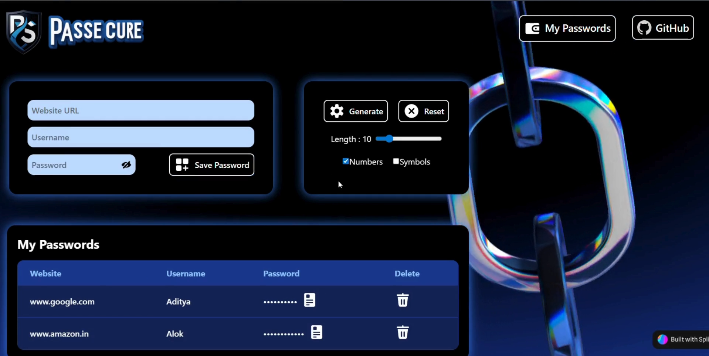

# 🔐 Passecure - A Modern Password Manager

Passecure is a sleek and secure password manager built using **React + Vite** for the frontend and **Express + MongoDB** for the backend. It allows users to:

- Store website credentials (URL, username, password)
- Generate strong random passwords
- View and copy saved credentials
- Experience a smooth UI with TailwindCSS and 3D visuals powered by Spline

---

## 🚀 Features

- 🔏 **Secure Credential Storage** – Save website, username, and password using MongoDB.
- 🧠 **Password Generator** – Generate random secure passwords on the fly.
- 🖱️ **Copy to Clipboard** – Quickly copy any saved password.
- 💻 **Modern UI/UX** – Built with TailwindCSS and React + Vite.
- 🎨 **3D Aesthetics** – Powered by Spline for an interactive background experience.

---

## 🧩 Tech Stack

**Frontend**  
- React + Vite  
- TailwindCSS  
- Spline 3D for background visuals  

**Backend**  
- Node.js + Express  
- MongoDB (via Mongoose)

---
## 📸 Preview

---
# 🔐 Sample Code Highlights

**Frontend Data Saving Logic:**
<pre>const savedetail = async () => {
  setinfoarray([...infoarray, { ...form, id: uuidv4() }]);
  await fetch("http://localhost:3000/", {
    method: "POST",
    headers: { "Content-Type": "application/json" },
    body: JSON.stringify({ ...form, id: uuidv4() }),
  });
  setform({ site: "", username: "", password: "" });
};</pre>
**Fetch Credentials from MongoDB:**
<pre>const getPasswords = async () => {
  const res = await fetch("http://localhost:3000/");
  const passwords = await res.json();
  setinfoarray(passwords);
};</pre>
**Backend Data Saving:**
<pre>app.post('/', async (req, res) => {
    const detail=req.body
    const db = client.db(dbName);
    const collection = db.collection('details');
    const findResult = await collection.insertOne(detail);
    res.send({success:true,result:findResult})
})</pre>
---

## 🛠️ Setup Instructions

# 🔧 Backend Setup

cd passecure

## Go to backend folder 
cd backend

## Install dependencies
npm install

## Create .env file
touch .env

# 💻 Frontend Setup

## From project root
cd frontend

## Install frontend dependencies
npm install

## Run the app
npm run dev

# Made with ❤️ using React, Tailwind, Express & MongoDB

[def]: ./Screenshot.png
